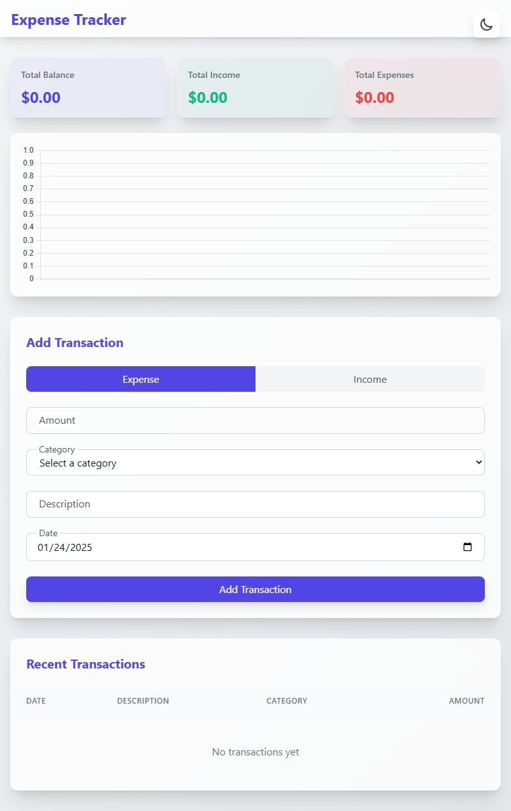

# ✨ Magical Expense Tracker

A beautiful and intuitive expense tracking application built with React and enhanced with magical UI effects. Keep track of your finances with style!

🔗 [Live Demo](https://expense-tracker-theta-smoky.vercel.app/)


## ✨ Features

- **Beautiful Animated Background**: Dreamy gradient animations with subtle movements
- **Dark/Light Mode**: Seamless theme switching with persisted preference
- **Income & Expense Tracking**: Easy-to-use interface for managing transactions
- **Financial Summary**: Real-time overview of your total balance, income, and expenses
- **Transaction History**: Chronological list of all your financial activities
- **Category Management**: Organize transactions by customizable categories
- **Responsive Design**: Works beautifully on all devices
- **Glassmorphic UI**: Modern, translucent interface elements

## 🎨 Visual Effects

The application features a stunning animated background created with:
- Multi-color gradient transitions
- Subtle rotation and scaling animations
- Dreamy blur effects
- Smooth color transitions
- Responsive and adaptive design
- Dark mode optimization

## 🛠️ Technologies Used

- **React**: Frontend library
- **TailwindCSS**: Utility-first CSS framework
- **Context API**: State management
- **LocalStorage**: Data persistence
- **Vite**: Build tool and development server

## 🚀 Getting Started

### Prerequisites

- Node.js (v14 or higher)
- npm or yarn

### Installation

1. Clone the repository:
```bash
git clone https://github.com/alidiamond1/Expense-Tracker.git
cd Expense-Tracker
```

2. Install dependencies:
```bash
npm install
# or
yarn install
```

3. Start the development server:
```bash
npm run dev
# or
yarn dev
```

4. Open your browser and navigate to `http://localhost:5173`

## 💫 Usage

1. **Add Transactions**:
   - Click the "Add Transaction" button
   - Select transaction type (Income/Expense)
   - Enter amount and description
   - Choose a category
   - Submit!

2. **View Summary**:
   - Total balance displayed at the top
   - Separate cards for total income and expenses
   - Visual representation of financial status

3. **Manage Transactions**:
   - View all transactions in chronological order
   - Filter by type or category
   - Delete transactions as needed

4. **Theme Switching**:
   - Toggle between light and dark modes
   - Theme preference is automatically saved

## 🎨 UI/UX Features

- **Animated Gradient Background**:
  - Smooth color transitions
  - Subtle rotation and scaling effects
  - Optimized for both light and dark modes

- **Glassmorphic Components**:
  - Translucent card effects
  - Smooth hover animations
  - Responsive feedback on interaction

- **Accessibility**:
  - High contrast text
  - Clear visual hierarchy
  - Keyboard navigation support

## 🤝 Contributing

Contributions are welcome! Feel free to:
1. Fork the repository
2. Create your feature branch
3. Commit your changes
4. Push to the branch
5. Open a Pull Request

## 📝 License

This project is open source and available under the [MIT License](LICENSE).

## 🌟 Acknowledgments

- Inspired by modern financial management tools
- Built with love for the developer community
- Special thanks to all contributors

---



⭐️ If you found this project helpful, please give it a star on [GitHub](https://github.com/alidiamond1/Expense-Tracker.git)!

Made with ❤️ by [Ali Diamond](https://github.com/alidiamond1)


